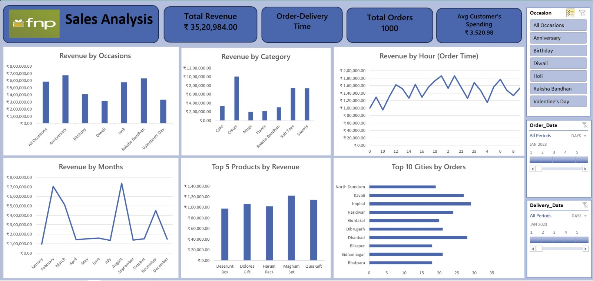

# 🌸 Ferns and Petals Sales Analysis Dashboard

## 📌 Project Overview

This project presents a sales analysis dashboard developed to evaluate revenue trends, customer behavior, product performance, and delivery efficiency for a gifting and e-commerce business. The dashboard uses data visualization techniques to identify sales patterns across occasions and support data-driven business decisions.

---

## 🎯 Objectives

* Analyze total revenue and sales performance
* Identify top-selling products
* Evaluate customer spending behavior
* Monitor delivery time efficiency
* Compare revenue across occasions
* Identify cities with the highest number of orders

---

## 📊 Key Metrics

| Metric                | Description                         |
| --------------------- | ----------------------------------- |
| Total Revenue         | Overall sales revenue generated     |
| Total Orders          | Number of customer orders           |
| Average Delivery Time | Time taken to deliver orders        |
| Top Products          | Highest revenue-generating products |
| Top Cities            | Cities with highest order volume    |

---

## 📈 Dashboard Features

* Monthly sales trend analysis
* Top product performance tracking
* Occasion-based revenue comparison
* City-wise order distribution
* Delivery time analysis
* Customer spending insights

---

## 🛠️ Tools and Technologies

* Power BI
* Microsoft Excel
* Data Cleaning and Transformation
* Data Visualization
* Business Intelligence

---

## 🖼️ Dashboard Preview




---

## 📌 Business Value

* Supports sales performance monitoring
* Helps identify high-demand products
* Improves delivery and operational efficiency
* Enables better business planning
* Supports data-driven decision-making

---

## 🚀 Future Improvements

* Predictive sales forecasting
* Customer segmentation analysis
* Real-time sales dashboard integration
* Regional sales performance comparison

---

## 📂 Project Structure

```
Ferns-and-Petals-Sales-Analysis/
│
├── Ferns_and_Petals_Dashboard.pbix
├── sales_dataset.xlsx
├── sales_dashboard.png
└── README.md
```

---

## 👤 Author

Hiba Fathima Y
Data Analyst / Data Science Enthusiast
